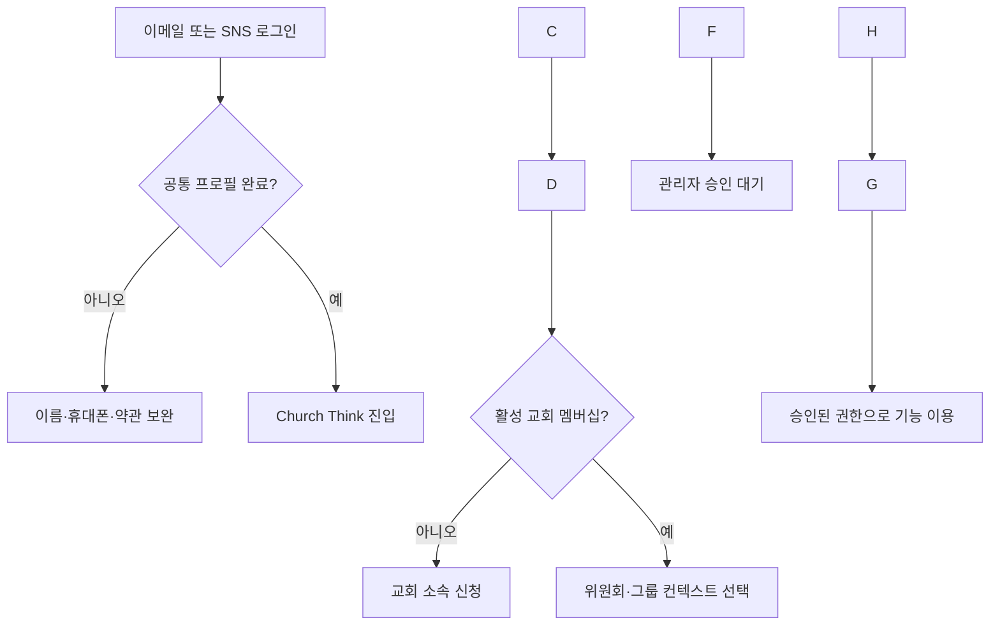

# Booza Think 회원관리·SNS 간편가입·Church Think 소속/권한 통합 작업지시서

## 1\. 작업 목적

Booza Think를 상위 플랫폼으로 두고, 하나의 공통 계정으로 Church Think 등 개별 서비스를 이용할 수 있도록 인증·회원관리 구조를 정비한다.

이번 작업에서 다음 네 가지를 함께 구현한다.

1. Booza Think 전체 가입자를 조회·관리하는 플랫폼 관리자 페이지
2. 이메일/비밀번호 로그인과 카카오·Google SNS 간편가입
3. Church Think 사용자가 자신의 설정 화면에서 교회·위원회·그룹 소속을 신청하고 변경하는 기능
4. 부서장·교역자·Church 관리자만 승인된 범위 안에서 권한을 부여·회수하는 기능

> 핵심 원칙: \\\*\\\*가입과 로그인은 편하게, 소속은 신청과 승인으로, 권한은 검증된 관리자만 부여한다.\\\*\\\*

\---

## 2\. 반드시 지켜야 할 아키텍처 원칙

### 2.1 플랫폼과 서비스의 책임 분리

|계층|관리 대상|포함하면 안 되는 정보|
|-|-|-|
|Booza Think Platform Core|로그인, 공통 프로필, 계정 상태, 인증수단, 약관, 플랫폼 역할|Church의 위원회·그룹·직책|
|Church Think|교회 멤버십, 위원회·그룹 소속, 직책, 역할, 권한, 현재 업무 컨텍스트|Stock Think·Estate Think의 소속과 권한|
|다른 Think 서비스|해당 서비스만의 멤버십과 권한|Church Think의 조직·직책·Assignment|

* Church Think의 조직·직책·권한은 Church Think 내부에서만 사용한다.
* Church Think 화면에서는 현재 단계에서 Booza Think 포털이나 다른 Think 서비스 메뉴를 노출하지 않는다.
* 공통 계정은 공유하되 사용자는 Church Think를 독립 서비스처럼 이용할 수 있어야 한다.
* 인증(Authentication)과 권한(Authorization)을 절대로 같은 개념으로 처리하지 않는다.
* SNS 로그인 성공은 본인 확인 성공일 뿐, Church Think 가입 승인이나 권한 승인이 아니다.

### 2.2 데이터 분리 원칙

다음 객체를 각각 분리한다.

1. `auth.users`: Supabase 인증 계정
2. `platform\\\_users`: Booza Think 공통 사용자 프로필과 계정 상태
3. `church\\\_memberships`: 특정 교회에 대한 서비스 멤버십
4. `church\\\_assignment\\\_requests`: 위원회·그룹 소속 신청
5. `church\\\_assignments`: 승인된 실제 소속과 직책
6. `church\\\_role\\\_grants`: 승인자가 부여한 권한
7. `platform\\\_user\\\_preferences`: 공통 사용자 설정(JSONB)
8. `audit\\\_logs`: 상태·소속·권한 변경 이력

DB를 최종 진실의 원천(Source of Truth)으로 사용한다. `localStorage`는 현재 컨텍스트 등의 임시 캐시로만 사용하고, 권한 판단에 사용하지 않는다.

### 2.3 기존 DB 보호

* 기존 마이그레이션 파일을 수정하지 않는다.
* 현재 스키마와 코드에서 이미 존재하는 테이블·역할·API를 먼저 조사한다.
* 동일 의미의 테이블이나 컬럼을 새로 중복 생성하지 않는다.
* 필요한 변경은 날짜가 포함된 **새로운 idempotent migration**으로 작성한다.
* 기존 `assigned\\\_at`, `revoked\\\_at` 명칭을 유지한다. `started\\\_at`, `ended\\\_at`으로 변경하지 않는다.
* 소속과 권한 이력은 hard delete하지 않고 `revoked\\\_at`, 상태값, 변경 이력으로 보존한다.

\---

## 3\. 목표 사용자 흐름



### 3.1 신규 사용자

1. 로그인 화면에서 이메일 가입 또는 `카카오로 계속하기`, `Google로 계속하기`를 선택한다.
2. OAuth 완료 후 `auth.users`와 `platform\\\_users`가 생성된다.
3. SNS에서 필수 정보가 오지 않은 경우 공통 프로필 완료 화면으로 이동한다.
4. 이름, 휴대폰, 필수 약관 동의를 완료한다.
5. Church Think에 처음 진입했는데 활성 교회 멤버십이 없으면 대시보드 대신 소속 신청 화면을 표시한다.
6. 사용자는 교회를 검색·선택하고 교회 멤버십을 신청한다.
7. 교회 멤버십 승인 후 사용자는 설정 페이지에서 위원회·그룹 소속을 추가 신청한다.
8. 승인자가 승인하면 `church\\\_assignments`가 생성된다.
9. 필요한 업무 권한은 승인자가 별도로 부여한다.

### 3.2 기존 이메일 사용자의 SNS 연결

* 로그인된 사용자는 `설정 > 로그인 및 보안`에서 카카오 또는 Google 계정을 연결할 수 있다.
* 검증된 동일 이메일은 Supabase의 identity linking 정책을 활용하되, 최종 기준은 동일한 `auth.users.id`인지 확인한다.
* 이메일이 다르거나 카카오 이메일이 제공되지 않은 계정은 이름·휴대폰만으로 자동 병합하지 않는다.
* 의심되는 중복 계정은 플랫폼 관리자가 확인할 수 있게 표시하되 자동 병합 기능은 이번 범위에 넣지 않는다.
* 사용자가 연결된 인증수단을 해제할 때는 최소 한 개의 로그인 수단이 남아 있어야 한다.

\---

## 4\. SNS 간편가입 구현 범위

### 4.1 1차 적용 제공자

|우선순위|제공자|적용 이유|구현 방식|
|-|-|-|-|
|1|카카오|국내 교회 사용자 접근성이 가장 높음|Supabase Auth `provider: 'kakao'` OAuth|
|2|Google|범용성 및 계정 복구 편의|Supabase Auth `provider: 'google'` OAuth|
|유지|이메일/비밀번호|SNS 미사용자와 관리자 계정 지원|기존 Supabase Auth 흐름 유지|
|추후|Apple·네이버 등|실제 사용자 수요 확인 후 추가|별도 검토|

네이버는 Supabase 기본 제공자 여부와 커스텀 OAuth 운영 부담을 별도 검토한 뒤 2차 범위로 둔다. 1차 작업에서 불필요한 커스텀 인증 서버를 만들지 않는다.

### 4.2 카카오 설정

1. Kakao Developers에 Booza Think 인증용 애플리케이션을 생성한다.
2. REST API Key를 Supabase Kakao Provider의 Client ID로 등록한다.
3. Kakao Login Client Secret을 발급·활성화하고 Supabase에 등록한다.
4. Supabase가 제공하는 callback URL을 카카오 Redirect URI에 등록한다.
5. 운영 도메인과 개발 도메인의 redirect URL을 Supabase 허용 목록에 각각 등록한다.
6. 카카오 로그인 활성화와 동의항목을 설정한다.
7. 최소 요청 범위는 닉네임, 프로필 이미지, 가능하면 이메일로 제한한다.
8. 이메일을 필수로 사용하려면 카카오 비즈 앱 전환과 `account\\\_email` 제공 조건을 확인한다.

### 4.3 OAuth 콜백 처리

* 클라이언트에서 `signInWithOAuth()`를 호출한다.
* 콜백 라우트는 authorization code를 세션으로 교환한 뒤 내부 상대경로만 허용해 redirect한다.
* `next` 파라미터를 사용할 경우 외부 URL로 이동할 수 없게 검사한다.
* OAuth 성공 후 서버 또는 DB 트리거를 통해 `platform\\\_users`를 upsert한다.
* upsert 키는 이메일이 아니라 `auth.users.id`를 사용한다.
* OAuth access token, refresh token, client secret은 `public` 스키마나 로그에 저장하지 않는다.
* 로그인 제공자가 보내는 닉네임·사진은 초기값으로만 사용한다. 사용자가 수정한 공통 프로필을 매 로그인 때 덮어쓰지 않는다.

### 4.4 SNS 가입 후 필수 보완 정보

SNS 로그인만으로 다음 필수정보가 완성되지 않을 수 있다.

|필드|처리 방식|
|-|-|
|이름|SNS 닉네임을 초기값으로 제안하되 사용자가 실명을 확인·수정|
|이메일|제공되면 저장, 없으면 선택 입력 또는 별도 인증 흐름 제공|
|휴대폰|사용자가 직접 입력하고 가능하면 OTP 인증|
|필수 약관|OAuth 제공자의 동의와 별개로 Booza Think 약관에 직접 동의|
|프로필 완료|필수값과 약관 완료 시 `profile\\\_completed\\\_at` 기록|

프로필 미완료 사용자는 `user\\\_status = PENDING`으로 두고, 공통 프로필 완료 외의 민감 기능을 제한한다. 완료 후 `ACTIVE`로 전환한다.

\---

## 5\. 플랫폼 전체 회원관리 페이지

### 5.1 접근 경로와 권한

* 경로: `/admin/users`
* 접근 가능: `PLATFORM\\\_ADMIN` 또는 기존 시스템의 동등한 플랫폼 관리자 권한
* `SERVICE\\\_ADMIN`, `CHURCH\\\_ADMIN`, 부서장, 교역자는 플랫폼 전체 가입자를 볼 수 없다.
* 플랫폼 관리자 확인은 프론트 메뉴 숨김만으로 처리하지 말고 API와 DB 정책에서도 검증한다.

### 5.2 목록 화면

상단 요약 카드:

* 전체 가입자 수
* 활성 사용자 수
* 프로필 미완료 수
* 최근 7일 신규 가입자 수
* 차단 사용자 수
* Church Think 멤버십 승인 대기 수

목록 컬럼:

|컬럼|설명|
|-|-|
|사용자|이름, 프로필 이미지|
|아이디|기존 username을 유지하는 경우 표시|
|이메일|미제공 가능 상태를 명확히 표시|
|휴대폰|권한에 따라 마스킹|
|가입 방식|Email, Kakao, Google 배지; 여러 개 연결 가능|
|플랫폼 상태|`ACTIVE`, `PENDING`, `BLOCKED`, `WITHDRAWN`|
|이용 서비스|Church Think 등 활성 멤버십 요약|
|가입일|`created\\\_at`|
|최근 로그인|`last\\\_sign\\\_in\\\_at`|

검색·필터:

* 이름, username, 이메일, 휴대폰 검색
* 가입 방식 필터
* 플랫폼 상태 필터
* 가입일 범위
* 이용 서비스 필터
* 최근 로그인 유무
* 정렬 및 페이지네이션

### 5.3 회원 상세 화면

다음 탭으로 구성한다.

1. 기본정보: 공통 프로필, 가입일, 최근 로그인, 프로필 완료 여부
2. 로그인 수단: Email/Kakao/Google 연결 상태와 provider ID의 마스킹 값
3. 서비스 멤버십: Church Think 교회별 멤버십 상태 요약
4. 권한: 플랫폼 역할과 서비스 역할을 구분해서 읽기 전용으로 표시
5. 변경 이력: 차단·해제·멤버십·Assignment·Role Grant 이력

관리 액션:

* 플랫폼 계정 차단·해제
* 이메일 사용자의 비밀번호 재설정 메일 발송
* OAuth 전용 사용자에게는 비밀번호를 임의 생성하지 말고 로그인 수단 추가 안내
* 상태 변경 사유 입력
* 탈퇴 상태 확인

> 관리자가 사용자의 현재 비밀번호나 비밀번호 해시를 조회하는 기능은 절대로 만들지 않는다.

### 5.4 계정 상태

|상태|의미|로그인/이용 정책|
|-|-|-|
|`PENDING`|공통 프로필·약관 미완료|프로필 완료 화면만 허용|
|`ACTIVE`|정상 계정|승인된 서비스와 권한 범위 이용|
|`BLOCKED`|플랫폼 관리자 차단|전 서비스 접근 차단|
|`WITHDRAWN`|본인 탈퇴|로그인 차단, 이력 보존|

기존 `is\\\_active`가 있다면 호환용으로만 유지하고, 비즈니스 상태 판단은 `user\\\_status`를 기준으로 통합한다. 기존 코드가 `is\\\_active`만 보는 구간을 전수 조사해 단계적으로 교체한다.

\---

## 6\. Church Think 내 설정 페이지

### 6.1 화면 구성

경로 예시: `/settings` 또는 기존 마이페이지 내부

|탭|기능|
|-|-|
|공통 프로필|이름, 휴대폰, 프로필 이미지 등 Platform Core 정보 수정|
|로그인 및 보안|연결된 Email/Kakao/Google 확인, 로그인 수단 연결·해제|
|교회 소속|가입 교회, 멤버십 상태, 교회 추가·변경·탈퇴 신청|
|위원회·그룹|현재 승인된 소속, 추가 신청, 변경 신청, 철회 신청|
|내 직책·권한|승인된 직책과 실제 권한을 읽기 전용으로 확인|
|활동 이력|본인의 신청·승인·거절·해제 이력|

### 6.2 사용자가 직접 할 수 있는 일

* 교회 멤버십 신청
* 위원회·그룹 소속 추가 신청
* 기존 소속 변경·해제 신청
* 주 컨텍스트 선택
* 보유 권한과 승인자를 확인
* 아직 처리되지 않은 신청 취소

### 6.3 사용자가 직접 할 수 없는 일

* 자신의 교회 멤버십을 `ACTIVE`로 변경
* 자신의 Assignment를 승인 상태로 생성
* 자신의 직책이나 Role Grant 생성·수정
* 관리자·교역자·부서장 역할을 스스로 선택
* `is\\\_primary` 조작을 통해 승인되지 않은 조직 컨텍스트에 접근
* 프론트 요청값을 바꿔 권한을 상승시키는 행위

설정 UI에서 직책·권한은 선택 입력으로 제공하지 않는다. 필요한 경우 `희망 역할` 또는 `요청 사유`를 텍스트로 제출할 수 있지만, 실제 권한은 승인자가 별도 결정한다.

### 6.4 다중 소속과 현재 컨텍스트

* 한 사용자가 여러 위원회·그룹에 동시에 소속될 수 있어야 한다.
* 승인된 Assignment마다 `assigned\\\_at`, `revoked\\\_at`, `is\\\_primary`를 유지한다.
* 기본 컨텍스트는 활성 Assignment 중 `is\\\_primary = true`인 항목을 사용한다.
* 주 컨텍스트가 없으면 가장 최근 `assigned\\\_at`의 활성 Assignment를 사용한다.
* 사용자가 컨텍스트를 바꾸면 DB의 `platform\\\_user\\\_preferences` JSONB에 서비스 중립적인 형태로 저장한다.
* Church Think가 해당 preference를 Church Assignment로 해석한다.
* `SYSTEM\\\_ADMIN`은 권한 검사 우회가 가능하더라도 화면 필터링을 위해 컨텍스트를 선택할 수 있다.

\---

## 7\. Church Think 승인 및 권한 부여 로직

### 7.1 역할 구분

|역할|관리 범위|허용 작업|
|-|-|-|
|`PLATFORM\\\_ADMIN`/`SYSTEM\\\_ADMIN`|전체 플랫폼|플랫폼 계정 관리, 초기 Church 관리자 지정, 전체 감사|
|`CHURCH\\\_ADMIN`|자신이 관리하는 교회|교회 멤버십·모든 부서 소속 승인, 허용된 Church 역할 부여·회수|
|`PASTOR`/교역자|배정된 교회|교회 멤버십·부서 소속 승인, 정책상 허용된 Church 역할 부여·회수|
|`DEPARTMENT\\\_HEAD`/부서장|자신이 담당하는 위원회·그룹|해당 부서 소속 승인, 해당 부서의 하위 역할 부여·회수|
|일반 사용자|본인|신청·취소·조회만 가능|

역할명은 현재 프로젝트의 기존 role code와 매핑하고, 중복 role code를 만들지 않는다.

### 7.2 권한 범위 규칙

1. 부서장은 자신에게 배정된 `org\\\_unit\\\_id` 범위에서만 승인·권한 부여가 가능하다.
2. 교역자는 자신이 배정된 `church\\\_id` 범위에서만 가능하다.
3. Church 관리자는 자신이 관리하는 `church\\\_id` 범위에서만 가능하다.
4. 어떤 승인자도 본인에게 신규 권한을 직접 부여할 수 없다.
5. 승인자는 자신보다 상위인 역할을 부여할 수 없다.
6. `PLATFORM\\\_ADMIN`, `SYSTEM\\\_ADMIN`은 플랫폼 관리자만 부여·회수할 수 있다.
7. `CHURCH\\\_ADMIN`은 플랫폼 관리자 또는 정책상 허용된 기존 Church 관리자만 부여한다.
8. 역할을 부여할 때 대상 사용자의 활성 교회 멤버십과 해당 조직 Assignment를 확인한다.
9. 권한 회수 시 기존 행을 삭제하지 말고 `revoked\\\_at`, `revoked\\\_by`, `revoke\\\_reason`을 기록한다.
10. 프론트에서 보낸 `church\\\_id`, `org\\\_unit\\\_id`, `role\\\_id`를 신뢰하지 말고 서버가 승인자의 scope와 대조한다.

### 7.3 승인 흐름

#### 교회 멤버십

`REQUESTED → ACTIVE` 또는 `REQUESTED → REJECTED`

#### 위원회·그룹 Assignment 요청

`PENDING → APPROVED` 또는 `PENDING → REJECTED/CANCELLED`

* `APPROVED` 처리 시 하나의 트랜잭션 안에서 활성 멤버십 확인, 승인자 scope 확인, 요청 상태 변경, `church\\\_assignments` 생성, 감사 로그 생성을 수행한다.
* 중복 클릭과 재시도에도 Assignment가 중복 생성되지 않도록 unique 조건과 idempotency를 적용한다.

#### Role Grant

* Role Grant는 사용자의 신청값을 그대로 승인하는 방식이 아니라 승인자가 허용 목록에서 선택해 부여한다.
* 조직 직책과 시스템 권한을 1:1로 하드코딩하지 않는다.
* `church\\\_roles`와 `role\\\_permissions` 매핑을 통해 직책별 실제 권한을 관리한다.

\---

## 8\. DB 변경 설계

아래는 논리 모델이다. 먼저 기존 테이블과 매핑한 뒤 부족한 부분만 새 마이그레이션에 추가한다.

### 8.1 `platform\\\_users` 보완 후보

|컬럼|용도|
|-|-|
|`id`|내부 PK|
|`auth\\\_user\\\_id`|`auth.users.id`, UNIQUE|
|`username`|기존 아이디 로그인 사용 시 유지|
|`display\\\_name`|공통 표시 이름|
|`email`|제공되지 않을 수 있음|
|`phone`|사용자 입력/인증 정보|
|`avatar\\\_url`|프로필 이미지|
|`user\\\_status`|`PENDING/ACTIVE/BLOCKED/WITHDRAWN`|
|`profile\\\_completed\\\_at`|공통 프로필 완료 시각|
|`created\\\_at`, `updated\\\_at`|생성·수정 시각|

### 8.2 `church\\\_memberships`

|컬럼|용도|
|-|-|
|`id`|멤버십 PK|
|`user\\\_id`|Platform User FK|
|`church\\\_id`|교회 FK|
|`status`|`REQUESTED/ACTIVE/REJECTED/SUSPENDED/WITHDRAWN`|
|`requested\\\_at`|신청 시각|
|`approved\\\_at`, `approved\\\_by`|승인 정보|
|`rejected\\\_at`, `rejected\\\_by`, `rejection\\\_reason`|거절 정보|
|`withdrawn\\\_at`|탈퇴 시각|

### 8.3 `church\\\_assignment\\\_requests`

|컬럼|용도|
|-|-|
|`id`|요청 PK|
|`membership\\\_id`|활성 또는 승인 대기 멤버십 FK|
|`org\\\_unit\\\_id`|위원회·그룹 FK|
|`request\\\_type`|`ADD/CHANGE/REMOVE`|
|`status`|`PENDING/APPROVED/REJECTED/CANCELLED`|
|`request\\\_reason`|사용자 요청 사유|
|`requested\\\_at`|신청 시각|
|`reviewed\\\_at`, `reviewed\\\_by`|처리 정보|
|`review\\\_note`|승인·거절 사유|

### 8.4 `church\\\_assignments`

|컬럼|용도|
|-|-|
|`id`|Assignment PK|
|`membership\\\_id`|Church Membership FK|
|`org\\\_unit\\\_id`|승인된 위원회·그룹 FK|
|`position\\\_id`|조직 직책, nullable|
|`is\\\_primary`|기본 컨텍스트 여부|
|`assigned\\\_at`, `assigned\\\_by`|배정 정보|
|`revoked\\\_at`, `revoked\\\_by`, `revoke\\\_reason`|해제 정보|

활성 중복을 막는 partial unique index를 검토한다. 예: 동일 `membership\\\_id + org\\\_unit\\\_id`에서 `revoked\\\_at IS NULL`인 행은 하나만 허용한다.

### 8.5 `church\\\_role\\\_grants`

|컬럼|용도|
|-|-|
|`id`|Role Grant PK|
|`membership\\\_id`|대상 멤버십 FK|
|`assignment\\\_id`|조직 범위 권한이면 Assignment FK|
|`role\\\_id`|Church Role FK|
|`scope\\\_type`|`CHURCH/ORG\\\_UNIT`|
|`scope\\\_id`|실제 church 또는 org unit ID|
|`granted\\\_at`, `granted\\\_by`, `grant\\\_reason`|부여 정보|
|`revoked\\\_at`, `revoked\\\_by`, `revoke\\\_reason`|회수 정보|

### 8.6 감사 로그

최소 다음 이벤트를 기록한다.

* `USER\\\_STATUS\\\_CHANGED`
* `PASSWORD\\\_RESET\\\_SENT`
* `AUTH\\\_IDENTITY\\\_LINKED/UNLINKED`
* `CHURCH\\\_MEMBERSHIP\\\_REQUESTED/APPROVED/REJECTED/WITHDRAWN`
* `ASSIGNMENT\\\_REQUESTED/APPROVED/REJECTED/REVOKED`
* `ROLE\\\_GRANTED/REVOKED`
* `PRIMARY\\\_CONTEXT\\\_CHANGED`

감사 로그에는 `actor\\\_user\\\_id`, `target\\\_user\\\_id`, `church\\\_id`, `org\\\_unit\\\_id`, 변경 전후 값, 사유, 발생 시각을 남긴다. 비밀번호·OAuth token·client secret은 로그에 남기지 않는다.

\---

## 9\. API 작업 목록

실제 경로는 기존 백엔드 규칙에 맞추되 책임은 아래와 같이 분리한다.

### 9.1 공통 계정

* `GET /api/me/profile`
* `PATCH /api/me/profile`
* `GET /api/me/auth-identities`
* `POST /api/me/auth-identities/link/:provider`
* `DELETE /api/me/auth-identities/:identityId`

### 9.2 플랫폼 관리자

* `GET /api/admin/users`
* `GET /api/admin/users/:userId`
* `PATCH /api/admin/users/:userId/status`
* `POST /api/admin/users/:userId/send-password-reset`
* `GET /api/admin/users/:userId/audit-logs`

### 9.3 Church 사용자

* `GET /api/church/me/memberships`
* `POST /api/church/me/membership-requests`
* `POST /api/church/me/assignment-requests`
* `PATCH /api/church/me/assignment-requests/:requestId/cancel`
* `GET /api/church/me/assignments`
* `GET /api/church/me/roles`
* `PATCH /api/church/me/primary-context`

### 9.4 Church 승인자

* `GET /api/church/admin/membership-requests`
* `POST /api/church/admin/membership-requests/:requestId/approve`
* `POST /api/church/admin/membership-requests/:requestId/reject`
* `GET /api/church/admin/assignment-requests`
* `POST /api/church/admin/assignment-requests/:requestId/approve`
* `POST /api/church/admin/assignment-requests/:requestId/reject`
* `POST /api/church/admin/role-grants`
* `POST /api/church/admin/role-grants/:grantId/revoke`

상태 변경 API는 모두 서버에서 현재 상태와 허용 가능한 다음 상태를 검증한다. 사용자가 body에 `approved\\\_by`, `granted\\\_by`를 넣어도 무시하고 인증 세션의 사용자 ID를 기록한다.

\---

## 10\. RLS 및 보안 요구사항

1. 일반 사용자는 자신의 `platform\\\_users` 프로필 중 허용된 필드만 조회·수정할 수 있다.
2. 일반 사용자는 자신의 멤버십·신청·Assignment·Role Grant만 조회한다.
3. 일반 사용자는 신청 행은 만들 수 있지만 승인 컬럼을 직접 변경할 수 없다.
4. Church 승인자는 서버에서 검증된 church/org unit scope 안의 요청만 조회·처리한다.
5. 플랫폼 전체 사용자 조회와 상태 변경은 backend의 service role 경로에서만 수행하고, 매 요청마다 `PLATFORM\\\_ADMIN`을 검증한다.
6. `platform\\\_users.user\\\_status`가 `BLOCKED` 또는 `WITHDRAWN`이면 모든 서비스 API에서 거부한다.
7. 브라우저 번들의 환경변수에 service role key, Kakao client secret 등을 포함하지 않는다.
8. OAuth redirect allow list는 실제 운영·개발 도메인만 등록하고 와일드카드 사용을 최소화한다.
9. 비밀번호 재설정 응답은 계정 존재 여부를 과도하게 노출하지 않는다.
10. 역할 부여·회수와 계정 차단에는 rate limit, CSRF 방어, 감사 로그를 적용한다.

\---

## 11\. 프론트엔드 작업

### 11.1 로그인/가입 화면

* 상단 주요 버튼: `카카오로 계속하기`
* 보조 버튼: `Google로 계속하기`
* 구분선 아래 기존 이메일/비밀번호 가입·로그인
* 로그인과 가입을 별도 계정 생성 로직으로 나누지 말고, OAuth 결과에 따라 신규/기존 사용자를 동일한 콜백에서 처리
* 로딩 중 중복 클릭 방지
* OAuth 취소, redirect 오류, provider 설정 오류에 대한 사용자 친화적 오류 문구

### 11.2 공통 프로필 온보딩

* 최초 SNS 로그인 후 필수값이 부족한 경우 자동 이동
* 어떤 정보가 왜 필요한지 설명
* 약관 동의 전 Church 기능 진입 차단
* 저장 완료 후 원래 진입하려던 내부 경로로 복귀

### 11.3 Church 소속 설정

* 승인됨/승인 대기/거절/해제 상태를 색상과 문구로 명확히 구분
* 여러 위원회·그룹을 카드 또는 표로 표시
* `소속 추가 신청`, `변경 신청`, `해제 신청` 액션 분리
* 권한은 읽기 전용이며 `부여자`, `부여일`, `범위` 표시
* 승인되지 않은 요청은 대시보드 권한으로 즉시 반영하지 않음

### 11.4 승인자 화면

* `소속 승인 대기`, `권한 관리` 메뉴 제공
* 승인자가 담당하는 범위의 요청만 표시
* 승인·거절 시 메모 입력
* 역할 부여 UI에는 승인자가 줄 수 있는 역할만 서버 응답 기준으로 표시
* 민감 역할은 경고와 재확인 모달 제공

\---

## 12\. 구현 순서

### 0단계: 현행 조사

* 인증 라이브러리, Supabase 설정, redirect 경로 확인
* 기존 회원·멤버십·Assignment·Role 테이블과 API 목록 작성
* 기존 관리자 메뉴와 platform role 구조 확인
* `is\\\_active`, `user\\\_status`, `auth.users.id` 참조 구간 전수 검색
* 조사 결과와 신규 변경 매핑표를 먼저 보고한 뒤 구현 시작

### 1단계: DB 및 권한 기반

* 새 idempotent migration 작성
* 상태 enum/check constraint와 index 추가
* 요청·Assignment·Role Grant·감사 로그 보완
* RLS 및 서버 권한 검사 구현

### 2단계: 플랫폼 회원관리

* `/admin/users` 목록·상세·검색·필터
* 차단·해제, 재설정 메일, 감사 이력
* 비밀번호 비노출 및 provider 표시

### 3단계: SNS 간편가입

* Kakao, Google provider 설정
* OAuth 콜백과 profile upsert
* 최초 로그인 프로필 보완
* 기존 계정 identity linking

### 4단계: Church 소속과 승인

* 사용자 설정 탭
* 멤버십·Assignment 신청
* 승인자 처리 화면
* 다중 Assignment 및 주 컨텍스트
* Role Grant 부여·회수

### 5단계: 통합 검증

* 권한 상승 공격 테스트
* 중복 계정·중복 승인·재시도 테스트
* 기존 이메일 사용자 회귀 테스트
* 운영 도메인 OAuth redirect 테스트

\---

## 13\. 필수 테스트 시나리오

### 13.1 인증

1. 신규 사용자가 카카오로 가입하고 필수 프로필을 완료한다.
2. 카카오 이메일이 없는 사용자도 별도 사용자 ID로 정상 생성된다.
3. 기존 이메일 사용자가 로그인 후 카카오 계정을 연결한다.
4. 동일 이메일 OAuth 로그인 시 기존 계정 연결 여부를 검증한다.
5. 로그아웃 후 Email/Kakao/Google 각 연결 수단으로 같은 사용자에 로그인된다.
6. 마지막 한 개의 로그인 수단은 해제되지 않는다.
7. 잘못된 redirect와 외부 `next` URL은 차단된다.

### 13.2 플랫폼 관리자

1. 플랫폼 관리자는 전체 회원을 조회·검색·필터한다.
2. Church 관리자와 일반 사용자는 `/admin/users` API 접근이 403 처리된다.
3. 차단 사용자는 기존 세션을 사용해도 서비스 API가 거부된다.
4. 관리자는 비밀번호와 비밀번호 해시를 볼 수 없다.
5. OAuth 전용 사용자에게 잘못된 비밀번호 초기화 액션이 노출되지 않는다.

### 13.3 Church 멤버십과 소속

1. 일반 사용자가 교회·위원회·그룹을 신청해도 즉시 권한이 생기지 않는다.
2. 부서장은 자기 부서 요청만 승인할 수 있다.
3. 교역자와 Church 관리자는 자기 교회 범위만 처리할 수 있다.
4. 사용자는 여러 위원회·그룹에 동시에 승인될 수 있다.
5. 해제된 Assignment는 목록 이력에 남지만 권한 계산에서는 제외된다.
6. 주 컨텍스트가 없으면 최신 `assigned\\\_at` Assignment가 선택된다.

### 13.4 권한 상승 방어

1. 일반 사용자가 API body를 변조해 `APPROVED`로 변경하려 하면 실패한다.
2. 부서장이 다른 부서의 역할을 부여하려 하면 실패한다.
3. 교역자가 `PLATFORM\\\_ADMIN`을 부여하려 하면 실패한다.
4. 승인자가 자기 자신에게 역할을 부여하려 하면 실패한다.
5. revoked Role Grant로 보호된 기능에 접근하면 실패한다.
6. 프론트 메뉴를 강제로 열어도 API에서 403 처리된다.

### 13.5 데이터 무결성

1. 승인 버튼을 두 번 눌러도 활성 Assignment가 하나만 생성된다.
2. 재시도된 OAuth 콜백이 `platform\\\_users`를 중복 생성하지 않는다.
3. 모든 승인·거절·부여·회수에 actor, target, 사유, 시간이 남는다.
4. 기존 사용자와 기존 Church 데이터가 마이그레이션 후 유지된다.

\---

## 14\. 완료 기준(Definition of Done)

* 플랫폼 관리자가 Booza Think 전체 가입자를 안전하게 조회·관리할 수 있다.
* 이메일/비밀번호, 카카오, Google로 가입·로그인할 수 있다.
* 동일 사용자의 여러 로그인 수단이 하나의 `auth\\\_user\\\_id`에 연결된다.
* SNS 가입자가 필수 프로필과 약관을 완료하기 전에는 제한된 상태로 유지된다.
* Church 사용자가 설정에서 교회·위원회·그룹 소속을 신청·변경·해제할 수 있다.
* 사용자는 다중 소속을 가질 수 있고 승인된 컨텍스트만 선택할 수 있다.
* 일반 사용자는 자신의 직책·권한을 직접 부여하거나 수정할 수 없다.
* 부서장·교역자·Church 관리자는 지정된 scope 안에서만 권한을 부여·회수한다.
* 모든 중요 변경 이력이 보존되며 hard delete가 없다.
* 권한 없는 직접 API 호출과 프론트 변조가 403으로 차단된다.
* 신규 idempotent migration을 두 번 실행해도 오류나 중복 데이터가 발생하지 않는다.
* 기존 이메일 로그인과 Church Think 핵심 기능에 회귀 오류가 없다.

\---

## 15\. 금지사항

* SNS 로그인 성공만으로 Church 멤버십이나 업무 권한을 자동 부여하지 말 것
* 이메일을 유일한 내부 사용자 PK로 사용하지 말 것
* 이름·휴대폰이 같다는 이유로 계정을 자동 병합하지 말 것
* Church 직책을 Platform Core나 Stock/Estate Think에 저장·전파하지 말 것
* 사용자 요청값으로 `approved\\\_by`, `granted\\\_by`, scope를 확정하지 말 것
* 비밀번호 원문 또는 해시를 관리자 화면에 노출하지 말 것
* OAuth token과 client secret을 public DB, 브라우저, 로그에 저장하지 말 것
* 권한 검사를 프론트 메뉴 노출 여부에만 의존하지 말 것
* 기존 마이그레이션을 수정하거나 Assignment 이력을 hard delete하지 말 것
* 한 사람당 소속 하나만 허용하는 구조로 축소하지 말 것

\---

## 16\. 작업 완료 후 제출물

개발 완료 시 다음 내용을 함께 보고한다.

1. 변경한 파일 목록과 역할
2. 신규 DB migration 파일 전체 내용
3. 기존 테이블과 신규 논리 모델의 매핑표
4. 추가·변경한 API 목록
5. 역할별 권한 매트릭스
6. RLS 및 서버 권한 검사 설명
7. Kakao·Google Console에서 사람이 직접 설정해야 할 항목
8. 테스트 실행 결과와 실패/보류 항목
9. 운영 배포 순서와 rollback 방법
10. 관리자·일반 사용자 화면 캡처

\---

## 17\. 구현 참고 문서

* [Supabase 공식 Kakao 로그인 문서](https://supabase.com/docs/guides/auth/social-login/auth-kakao)
* [Supabase 공식 Identity Linking 문서](https://supabase.com/docs/guides/auth/auth-identity-linking)
* [Kakao Developers 카카오 로그인 문서](https://developers.kakao.com/docs/ko/kakaologin/common)

공식 문서의 현재 설정 화면과 프로젝트의 실제 프레임워크를 기준으로 구현하되, 본 지시서의 계층 분리·승인·권한 제한 원칙은 변경하지 않는다.

\---

## 18\. 작업에 사용할 AI 모델과 실행 방식

### 18.1 최종 권장 설정

이 작업의 주 모델은 다음과 같이 설정한다.

|구분|권장 모델|추론 강도|사용 범위|
|-|-|-|-|
|주 구현 모델|`gpt-5.6-sol`|`high`|전체 코드 조사, DB 설계, migration, OAuth, 관리자 페이지, Church 권한 구현|
|고위험 검토|`gpt-5.6-sol`|`xhigh`|RLS, 권한 상승 방어, 계정 연결, 마이그레이션 및 배포 전 최종 검토|
|반복 작업|`gpt-5.6-terra`|`medium`|명확히 정의된 UI 보완, 테스트 코드 추가, 문구·타입·단순 리팩터링|
|비권장 주 모델|`gpt-5.6-luna`|-|이번 인증·DB·권한 아키텍처의 주 구현에는 사용하지 않음|

가장 간단한 선택은 **GPT-5.6 Sol + High**다. 인증·회원 DB·관리자 권한이 동시에 바뀌는 작업이라 빠른 모델보다 구조적 판단과 검증 능력이 중요하다.

`xhigh`는 매 단계에 계속 사용할 필요는 없고 다음 작업에만 올린다.

* 기존 스키마와 신규 논리 모델 충돌 검토
* idempotent migration과 rollback 검토
* RLS와 서버 권한 검사의 우회 가능성 검토
* SNS 계정 중복·identity linking 검토
* 운영 배포 직전 전체 diff 리뷰

`max`는 테스트 실패 원인이 복합적이거나, 기존 구조가 문서와 크게 달라 해결이 막힌 경우에만 사용한다. 이번 작업은 병렬 하위 에이전트가 반드시 필요한 구조가 아니므로 Ultra를 기본으로 선택하지 않는다.

### 18.2 모델 버전 선택 원칙

* Codex/ChatGPT Work에서 모델을 직접 선택할 수 있으면 `GPT-5.6 Sol`을 선택한다.
* CLI 또는 모델 ID를 입력하는 화면에서는 `gpt-5.6-sol`을 사용한다.
* `gpt-5.6` 별칭도 현재 Sol로 연결되지만, 작업 기록의 재현성을 위해 명시적인 `gpt-5.6-sol` 표기를 권장한다.
* GPT-5.4 계열을 새 작업의 기본으로 지정하지 않는다. 공식 문서상 ChatGPT 로그인 기반 Codex에서는 2026년 8월 31일 은퇴 예정이므로, 장기 프로젝트 설정은 GPT-5.6 계열로 맞춘다.
* 사용 중인 개발 도구에서 GPT-5.6 Sol을 제공하지 않으면 그 도구의 최신 최상위 **코딩·추론 모델**을 선택하되, 아래 단계 분리와 검증 기준은 그대로 적용한다.

### 18.3 한 번에 전부 시키지 말고 4단계로 실행

같은 작업지시서를 기준으로 아래 네 번의 체크포인트로 나누어 진행한다.

#### 1차: 현행 조사만 수행

```text
첨부한 통합 작업지시서의 0단계만 수행해줘.
아직 파일을 수정하거나 migration을 실행하지 말고,
현재 인증·회원·멤버십·Assignment·Role·관리자 구조를 조사한 뒤
기존 구조와 작업지시서의 매핑표, 충돌 위험, 수정 예정 파일을 보고해줘.
불확실한 내용을 추측하지 말고 실제 코드와 DB 정의를 근거로 작성해줘.
```

권장 설정: `gpt-5.6-sol`, `high`

#### 2차: DB와 권한 기반 구현

```text
승인한 현행 조사 결과를 기준으로 통합 작업지시서의 1단계를 구현해줘.
기존 migration은 수정하지 말고 새 idempotent migration만 추가해줘.
DB 스키마, index, constraint, RLS, 서버 권한 검사를 구현하고
테스트를 실행해줘. 실제 운영 DB에는 자동 적용하지 말고 적용할 SQL과
검증 결과를 먼저 보고해줘.
```

권장 설정: `gpt-5.6-sol`, `xhigh`

#### 3차: 화면과 기능 구현

```text
검증된 DB·권한 기반 위에서 통합 작업지시서의 2\\\~4단계를 구현해줘.
플랫폼 회원관리, Kakao·Google 로그인, 공통 프로필 보완,
Church 소속 신청·승인, 다중 Assignment, Role Grant를 순서대로 구현하고
각 단계마다 기존 이메일 로그인 회귀 테스트를 실행해줘.
외부 Console에서 사람이 직접 설정해야 하는 값은 코드에 가짜로 넣지 말고
환경변수 이름과 설정 절차를 별도 체크리스트로 남겨줘.
```

권장 설정: `gpt-5.6-sol`, `high`

#### 4차: 독립적인 보안·회귀 검토

```text
통합 작업지시서와 현재 git diff를 기준으로 최종 검토해줘.
구현자의 설명을 그대로 믿지 말고 실제 코드, migration, RLS, API 테스트를 확인해줘.
특히 일반 사용자의 self-approval, 부서장 scope 이탈, 플랫폼 관리자 권한 획득,
OAuth 계정 중복, open redirect, service role key 노출, hard delete 여부를 점검해줘.
발견한 문제는 심각도 순으로 근거 파일과 함께 정리하고,
수정 가능한 항목은 수정한 뒤 전체 테스트 결과와 남은 위험을 보고해줘.
```

권장 설정: `gpt-5.6-sol`, `xhigh`

### 18.4 AI에게 반드시 제공할 자료

* 이 통합 작업지시서 전체
* 현재 Git 저장소 전체 접근 권한
* 기존 DB migration 폴더와 최신 스키마 덤프 또는 조회 가능한 개발 DB
* 현재 Render·Supabase 환경변수 **이름 목록**과 운영/개발 환경 구분
* 현재 로그인·회원가입·Church 설정·관리자 화면 캡처
* 재현 가능한 테스트 계정(일반 사용자, 부서장, 교역자, Church 관리자, 플랫폼 관리자)

실제 secret 값은 대화나 작업지시서에 붙여넣지 않는다. 개발 도구에 이미 안전하게 설정된 환경변수나 secret manager를 통해서만 사용한다.

### 18.5 작업 운영 원칙

* 한 AI 대화에서 처음부터 끝까지 이어가되, 단계별로 git diff와 테스트 결과를 남긴다.
* AI가 테이블이 없다고 추측해 새 테이블을 만들지 못하게 반드시 현행 조사를 먼저 시킨다.
* 운영 Supabase SQL 실행, 운영 OAuth Console 변경, production 배포는 사람이 결과를 검토한 뒤 진행한다.
* 각 단계가 끝날 때 `변경 파일`, `DB 영향`, `보안 영향`, `테스트 결과`, `다음 수동 작업` 다섯 항목으로 보고하게 한다.
* 모델의 말보다 실행된 테스트, SQL 결과, 실제 화면, git diff를 완료 판단의 근거로 삼는다.

