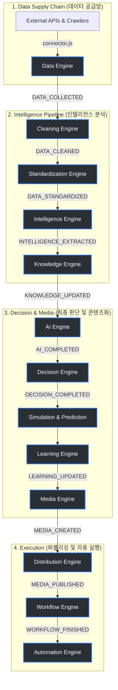

# Booza Think Platform OS - System Diagram

본 문서는 Booza Think Platform OS의 15대 코어 엔진 간의 데이터 흐름과 결합 관계를 시각화합니다.

---

## 📊 시스템 연동 다이어그램 (Mermaid System Diagram)

```mermaid
flowchart TD
    subgraph DataSupplyChain["1. Data Supply Chain (데이터 공급망)"]
        A[External APIs & Crawlers] -->|connector.js| B[Data Engine]
    end

    subgraph IntelligencePipeline["2. Intelligence Pipeline (인텔리전스 분석)"]
        B -->|DATA_COLLECTED| C[Cleaning Engine]
        C -->|DATA_CLEANED| D[Standardization Engine]
        D -->|DATA_STANDARDIZED| E[Intelligence Engine]
        E -->|INTELLIGENCE_EXTRACTED| F[Knowledge Engine]
    end

    subgraph DecisionAndMedia["3. Decision & Media (최종 판단 및 콘텐츠화)"]
        F -->|KNOWLEDGE_UPDATED| G[AI Engine]
        G -->|AI_COMPLETED| H[Decision Engine]
        H -->|DECISION_COMPLETED| I[Simulation & Prediction]
        I --> J[Learning Engine]
        J -->|LEARNING_UPDATED| K[Media Engine]
    end

    subgraph DistributionAndAutomation["4. Execution (퍼블리싱 및 자동 실행)"]
        K -->|MEDIA_CREATED| L[Distribution Engine]
        L -->|MEDIA_PUBLISHED| M[Workflow Engine]
        M -->|WORKFLOW_FINISHED| N[Automation Engine]
    end

    classDef core fill:#2a2f35,stroke:#3b82f6,stroke-width:2px,color:#fff;
    class B,C,D,E,F,G,H,I,J,K,L,M,N core;
```
