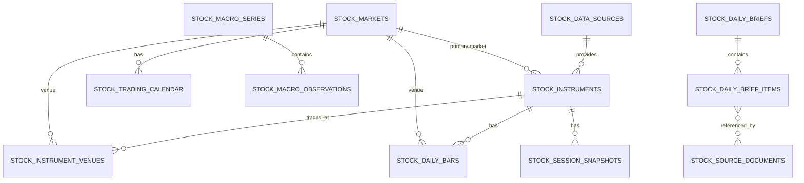

# Stock Think Data Model

## 1. 데이터 모델 설계 원칙
* **불변성(Immutability) 지향**: 과거 수정된 데이터는 덮어쓰지 않고 Vintage로 관리(특히 거시지표).
* **출처 명확성(Lineage)**: 모든 레코드는 `source_id`를 통해 어떤 기관에서 수집되었는지 추적.
* **정확도 우선**: 금액과 가격은 부동소수점 오차가 발생하지 않도록 PostgreSQL `NUMERIC` 타입을 사용하며 거래량은 `BIGINT` 사용.

## 2. KRX와 NXT 분리 이유
한국의 정규 거래소(KRX)와 대체거래소(NXT)는 동일한 주식 종목을 거래하지만, 거래 시간과 형성되는 가격, 유동성이 다릅니다. 이들을 하나의 가격으로 덮어쓸 경우 분석의 일관성이 훼손될 수 있으므로, 종가(`krx_close_price`)와 NXT의 세션별 가격(Pre-close, 애프터마켓 등)을 스냅샷으로 분리하여 관리합니다.

## 3. Instrument와 Venue 관계
* `stock_instruments`: "삼성전자 보통주"라는 하나의 투자 대상.
* `stock_instrument_venues`: "KRX", "NXT" 등 실제로 해당 종목을 거래할 수 있는 거래소(Venue)와의 매핑. 특정 종목이 NXT에서 거래되지 않거나 특정일부터 거래가 허용되는 이력을 관리합니다.

## 4. Daily Bar와 Session Snapshot 차이
* **Daily Bar**: 거래소에서 공식 발표한 하루 전체의 시가/고가/저가/종가/거래량(OHLCV) 묶음입니다.
* **Session Snapshot**: NXT 중간 가격, 장전 동시호가, 오전/오후 장중 특정 시점의 가격 등 틱 데이터를 모으지 않고도 주요 분기점의 시세를 보존하기 위해 스냅샷 형태로 저장합니다.

## 5. 거시지표 Vintage 보존 이유
경제 지표(예: 미국 GDP, 물가지수)는 최초 발표(Preliminary) 이후 1~3개월에 걸쳐 수정(Revised)됩니다. 과거 데이터를 최신 수정치로만 덮어쓰면, 당시 시장 참여자들이 보았던 정보와 현재의 백테스트 결과가 달라지는 "미래 참조 오류(Look-ahead bias)"가 발생합니다. 따라서 발표 시점 기준인 `vintage_date`를 포함하여 저장합니다.

## 6. Brief의 사실·계산·AI 해석 분리
Daily Brief의 아이템(Item)은 해당 내용의 성격(`evidence_type`)에 따라 `FACT`(실제 발생한 공시나 가격 변화), `CALCULATION`(퍼센트 하락 등 계산 결과), `AI_INTERPRETATION`(시장 주도 테마, 기대감 등 AI의 주관적 해석)으로 명확히 구분되어 저장됩니다. 이를 통해 투자자에게 근거 없는 주장을 사실처럼 제공하는 것을 방지합니다.

## 7. 수집 실패와 데이터 품질 추적
수집 파이프라인의 안정성을 위해 `stock_ingestion_runs`에서 실행 기록을, `stock_ingestion_errors`에서 발생 오류를 기록합니다. 정기적인 정합성 검사(고가가 시가보다 낮은지 등)를 통해 `stock_data_quality_issues`에 경고를 남깁니다.

## 8. Mermaid ERD

## 9. 테이블별 데이터 보존기간 후보
* **stock_daily_bars**: 무기한 보존 (시계열 분석을 위함)
* **stock_session_snapshots**: 최소 5년 보존 후 월 단위 압축 고려
* **stock_ingestion_runs / errors**: 1년 보존 후 폐기 (운영 목적)
* **stock_data_quality_issues**: 이슈 해결일로부터 1년 보존

## 10. 향후 파티셔닝 기준
데이터가 방대해질 경우 `stock_daily_bars`와 `stock_session_snapshots` 테이블은 `trade_date`를 기준으로 연 단위(Yearly) 파티셔닝(Partitioning)을 고려합니다.
